# 🚀 **THE BIG GOAT** 🐐

<div align="center">


[](https://git.io/typing-svg)

</div>

## 🌟 **Digital Alchemy Portfolio**

```mermaid
graph TD
    A[🚀 THE BIG GOAT] --> B[🛡 Blockchain Security]
    A --> C[🤖 AI Engineering]
    A --> D[🌐 Web3 Innovation]
    A --> E[💻 Full Stack Mastery]
    
    B --> B1[Smart Contracts]
    B --> B2[DeFi Protocols]
    B --> B3[NFT Ecosystems]
    
    C --> C1[Neural Networks]
    C --> C2[Computer Vision]
    C --> C3[Predictive Analytics]
    
    D --> D1[dApps]
    D --> D2[Cross-Chain]
    D --> D3[DAO Architectures]
    
    E --> E1[React/Next.js]
    E --> E2[Node.js/Python]
    E --> E3[Cloud Infrastructure]
```



## 🎯 **Quantum Tech Stack**

<div align="center">

### **⚡ Blockchain & Web3**


### **🤖 AI & Machine Learning**


### **🌐 Frontend Galaxy**


### **⚙️ Backend Universe**


</div>

## 📊 **Live Cosmic Analytics**

<div align="center">

|  |  |
| :---: | :---: |


</div>

## 🏆 **Trophy Case**

<div align="center">


</div>

## 🚀 **Revolutionary Projects**

### **🌌 Web3 & Blockchain**

<div align="center">

| Project | Status | Tech Stack | Impact |
|:--------|:-------|:-----------|:-------|
| **QuantumDEX** | 🟢 Live | Solidity, React, The Graph | $50M+ TVL |
| **NeuroNFT** | 🟢 Live | Rust, IPFS, ML | 10K+ NFTs |
| **GoatChain** | 🟡 Beta | Cosmos SDK, Go | PoS Layer 1 |
| **DeFi Oracle** | 🟢 Live | Python, Node.js, AWS | 99.9% Uptime |

</div>

### **🤖 AI & Machine Learning**

<div align="center">

| Project | Domain | Tech Stack | Accuracy |
|:--------|:-------|:-----------|:---------|
| **SmartAudit AI** | Security | PyTorch, Solidity | 98.7% |
| **Predictive DeFi** | Finance | TensorFlow, Web3 | 94.2% |
| **VisionChain** | Computer Vision | OpenCV, Blockchain | 96.8% |
| **ChatDApp** | NLP | OpenAI, React | Human-like |

</div>

## 💡 **Innovation Matrix**

```python
class BigGoatPortfolio:
    def __init__(self):
        self.expertise = {
            'blockchain': {
                'smart_contracts': ['EVM', 'WASM', 'ZK-SNARKs'],
                'protocols': ['DeFi', 'NFT', 'DAO', 'Layer2'],
                'auditing': ['Security', 'Gas Optimization', 'Formal Verification']
            },
            'ai_ml': {
                'deep_learning': ['CNN', 'RNN', 'Transformers'],
                'nlp': ['LLMs', 'Sentiment Analysis', 'Chatbots'],
                'computer_vision': ['Object Detection', 'GANs', 'AR/VR']
            },
            'web_development': {
                'frontend': ['React', 'Vue', 'WebGL', 'PWA'],
                'backend': ['Microservices', 'Serverless', 'Real-time'],
                'devops': ['K8s', 'Docker', 'CI/CD', 'Monitoring']
            }
        }
    
    def get_innovation_score(self):
        return "🚀 MAXIMUM OVERDRIVE"
```

## 🌈 **Tech Radar 2024**

<div align="center">

```mermaid
quadrantChart
    title Big GOAT Technology Radar
    x-axis "Adopt" → "Hold"
    y-axis "Assess" → "Trial"
    "ZK-Rollups": [0.2, 0.8]
    "AI Agents": [0.3, 0.7]
    "WebAssembly": [0.6, 0.6]
    "Quantum Computing": [0.8, 0.2]
    "Cross-chain": [0.4, 0.5]
    "Edge AI": [0.5, 0.4]
```

</div>

## 🎨 **Code Artistry**

```javascript
// 🎯 Smart Contract Excellence
contract BigGoatProtocol {
    mapping(address => uint256) public innovations;
    
    function createRevolution(string memory _innovation) external {
        innovations[msg.sender] = block.timestamp;
        emit InnovationCreated(_innovation, msg.sender);
    }
    
    // Gas optimized, secure, and revolutionary
    function changeTheWorld() external view returns (bool) {
        return true; // Always
    }
}
```

## 📈 **Performance Metrics**

<div align="center">

| Metric | Score | Level |
|:-------|:------|:------|
| **Code Quality** | ⭐⭐⭐⭐⭐ | Legendary |
| **Innovation** | ⭐⭐⭐⭐⭐ | Revolutionary |
| **Security** | ⭐⭐⭐⭐⭐ | Fort Knox |
| **Performance** | ⭐⭐⭐⭐⭐ | Lightspeed |
| **Scalability** | ⭐⭐⭐⭐⭐ | Infinite |


</div>

## 🌟 **Cosmic Connections**

<div align="center">

[](https://twitter.com/thebiggoat)
[](https://linkedin.com/in/thebiggoat)
[](https://github.com/thebiggoat)
[](https://thebiggoat.dev)
[](mailto:hello@thebiggoat.dev)

</div>

## 🎭 **Developer Philosophy**

> *"I don't just write code; I orchestrate digital symphonies. Every line is a note, every function a movement, and every system a masterpiece of technological artistry."*

## 🔮 **Currently Revolutionizing**

- **Zero-Knowledge Proofs** for private DeFi
- **Decentralized AI** model training
- **Quantum-resistant** cryptography
- **Autonomous** smart contract ecosystems
- **Neural interface** Web3 applications

---

<div align="center">

## ⚡ **READY TO BUILD THE FUTURE?** ⚡

**Your next groundbreaking project starts with a conversation...**


  

**"The code you write today becomes the legacy of tomorrow."** - **THE BIG GOAT**

</div>
our profile** - watch the magic happen! ✨

**This will transform your GitHub into an interstellar portfolio that leaves everyone speechless!** 🚀
